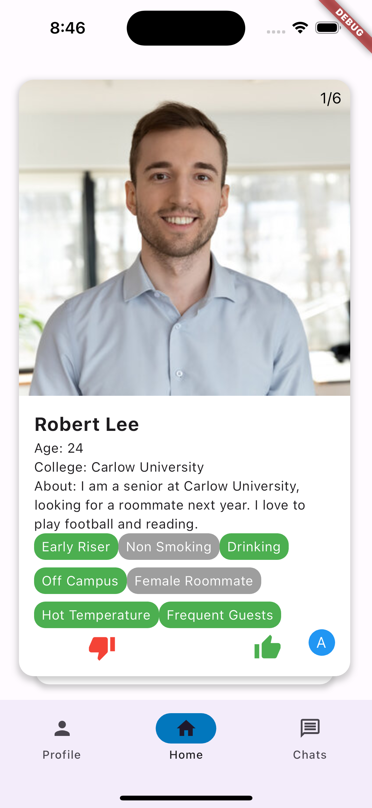
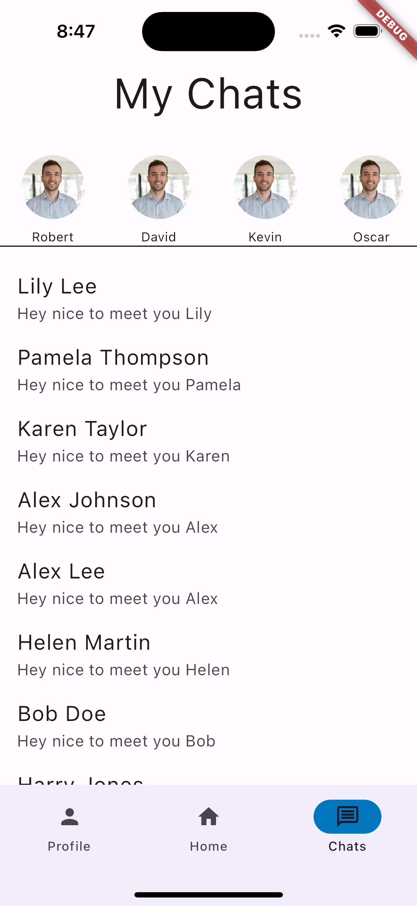

# Roommatch
Tinder meets Roommate Matching

## Supported devices/operating systems:
- iPhone 15 Pro (iOS 17.0.1) 

## Getting Started

In the root directory run `flutter clean` and `flutter pub get`.
Fire up the iOS simulator, initialize a device, and in the root directory, run `flutter run`.

## Using the app - Deliverable 3

Upon launching the app, you will be prompted to our welcome screen, where you can either "Log In", or "Sign Up".

For today's demo, click login. Enter an email address in the format of firstname.lastname@xxxxx.com and a random password (will not be saved). Then, click "Log In" and you will be taken to the home screen of the app where you swipe on possible matches. 

For our first key task, we implemented a card swiper which will wrap a user for display. The cards on display are randomly generated users with some if their information filled out, such as their institution, age, and a short bio. Swiping a card to the left is the equivalent of saying 'no', while swiping to the right is a 'yes'. Since the users on display aren't real, we implemented a blue admin button in the bottom right to force the user to swipe right on you (regardless of whether or not you match with them).

Once you match with another user, they are added to the list of matched users within the user model, which is then used to display the user's chat conversations in the "Chat" tab. 

For our second key task, we implemented a rudimentary profile page, which (with backend data) would populate with the user's images, name, age, institution, and bio. 

In the future, these fields will all be editable. You may notice two new tabs were added to the NavBar at the bottom of the screen: "Preferences" takes you to the preferences page, where you will be able to view and edit your demographic preferences;

"Settings" takes you to the app settings page, where you will be able to view and edit app settings as well as sensitive information, such as your email and password. These are currently just skeleton views; UI and details will be added later. 

Our last key task is a loosely location-based matching algorithm. Users have an affiliated institution attached to their profile, and a matching algorithm would take this into account when recommending possible matches. Currently, the user's institution is displayed in their profile card. 

**Navigate the app using only the NavBar for better usage**

Bugs:
- Swiping back from home screen: once you are logged in and have been taken to the home swiping screen, you can still swipe backwards to return to the login screen. This is a native iPhone feature, but we are working on a fix using either PopScope or by clearing the stack before changing screens.
- Swiping back from all screens: since swiping back to return is a native iPhone feature, this bug features on all screens. This will also be fixed in the future; in the meantime, navigate the app using only the NavBar to avoid errors or extraneous bugs occurring. 

## Contributors:
- Anirudh Iyer
- Erasto Omolo
- Calvin Forinash

