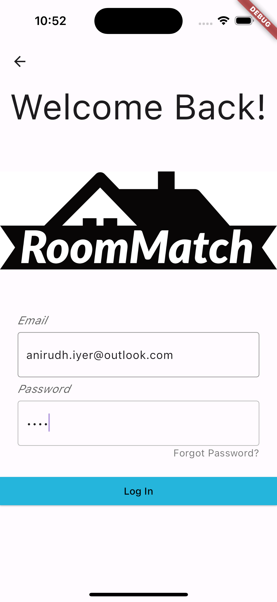
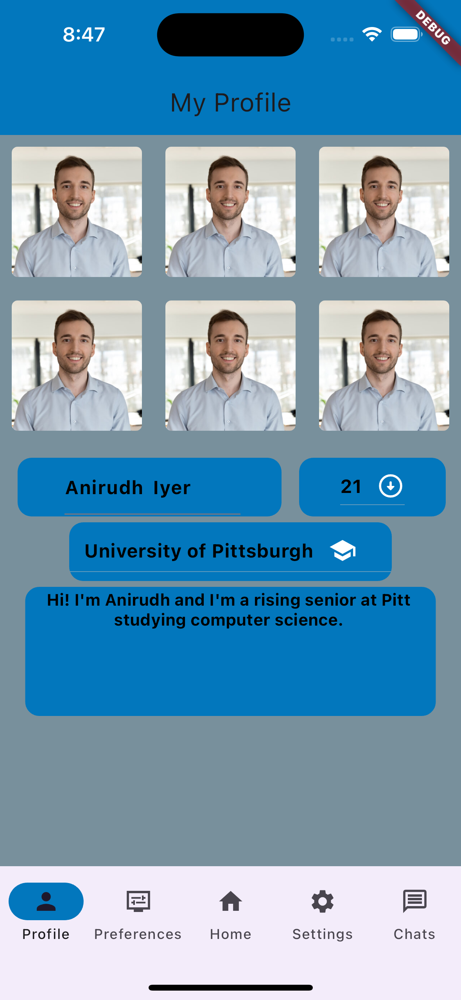

# Roommatch
Tinder meets Roommate Matching

## Supported devices/operating systems:
- iPhone 15 Pro (iOS 17.0.1) 

## Getting Started

In the root directory run `flutter clean` and `flutter pub get`.
Fire up the iOS simulator, initialize a device (iPhone 15 Pro), and in the root directory, run `flutter run`.

## Using the app 

Upon launching the app, you will be prompted to our welcome screen, where you can either "Log In", or "Sign Up".

Click either Sign Up or Log In. If you click login, enter an email address in the format of firstname.lastname@xxxxx.com and a random password (will not be saved). Then, click "Log In" and you will be taken to the home screen of the app where you swipe on possible matches. 

If you click "Sign Up", you will be taken to the sign up screen, where you will be prompted to enter your email address in the format of firstname.lastname@xxxxx.com, and password. Once you have entered all of the information, click "Sign Up" and you will be taken to the preferences screen where you can choose your preferences for a roommate.

Here, you can select one preference from each of the 7 categories. Choose either a preference on the right, or the left. These preferences are now saved to your user's object.

Once you have chosen your preferences, click "Submit" and you will be taken to the screen of the app where you can upload your own images. Placeholder images are uploaded here for demo purposes.

For our first key task, we implemented a card swiper which will wrap a user for display. The cards on display are randomly generated users with some of their information filled out, such as pictures, their name, their institution, age, and a short bio. You can swipe through the carousel of the user's images. Once again, placeholder images are uploaded here for demo purposes. Additionally, the user's preferences are displayed on the card. Green preferences mean both users have this in common, while a grey preference means that the other user does not have this preference.
Swiping a card to the left is the equivalent of saying 'no', while swiping to the right is a 'yes'. Alternatively, you can click the thumbs up or thumbs down icon. Since the users on display aren't real, we implemented a blue admin button in the bottom right to force the user to swipe right on you (regardless of whether or not you match with them).

Once you match with another user, a short animation is displayed.

Next, they are added to the list of matched users within the user model, which is then used to display the user's chat conversations in the "Chat" tab. To simulate conversations and matches, we send a random message "Hi, nice to meet you!" to every other matched user. 

Obviously, the other user isn't real and can't respond, but the message is displayed in the chat screen. Click on the message to view the messages screen. If you're okay keeping up both sides of the conversation, you can send a message back to the other user.

For our second key task, we implemented a profile page, populated with the user's images, name, age, institution, and bio. Here, you can edit your age, name, ad bio. There is also an extended task bar here, where you can edit your preferences, and other settings.

The "Preferences" tab takes you to the preferences page, where you will be able to view and edit the preferences you chose at the start.

"Settings" takes you to the app settings page, where you will be able to view and edit app settings as well as sensitive information, such as your user name and password.

Our last key task is a loosely location-based matching algorithm. Users have an affiliated institution attached to their profile, and a matching algorithm would take this into account when recommending possible matches. Currently, the user's institution is displayed in their profile card. 

**Navigate the app using only the NavBar for better usage**

Bugs:
- Swiping back from home screen: once you are logged in and have been taken to the home swiping screen, you can still swipe backwards to return to the login screen. This is a native iPhone feature, but we are working on a fix using either PopScope or by clearing the stack before changing screens.
- Swiping back from all screens: since swiping back to return is a native iPhone feature, this bug features on all screens. This will also be fixed in the future; in the meantime, navigate the app using only the NavBar to avoid errors or extraneous bugs occurring. 

## Contributors:
- [Anirudh Iyer](github.com/anirudhi89)
- [Calvin Forinash](github.com/ctf16)
- [Erasto Omolo](github.com/eoo5)

